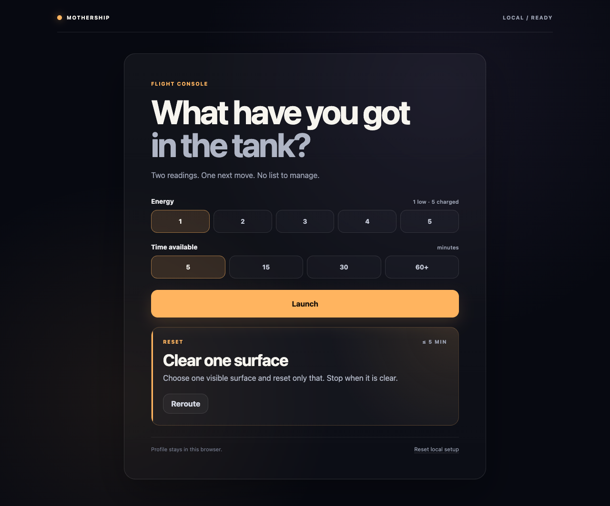

# Mothership

**What have you got in the tank?**

**Play:** <https://cashie1597.github.io/mothership/>

Mothership is a tiny flight console for days when a long task list is the wrong
answer. Pick your energy and available time; it offers one small mission. Reroute
if that one is not it. The mission deck includes making, resetting, moving,
listening, wandering, and pausing.

It is a scope-creep circuit breaker: one next move, with a boundary. There are
no accounts, dependencies, build service, or API keys.



## Run locally

Serve the repository directory with any static file server. For example:

```sh
python3 -m http.server 8000
```

Open <http://localhost:8000>. A local server is needed because the source uses
JavaScript modules; browser behavior for modules and storage opened via `file://`
varies.

## Test

With Node.js installed, run:

```sh
npm test
```

There is nothing to install: the tests use Node's built-in test runner. The
published site uses the files in this repository root directly.

## Data and privacy

The profile stays in your browser's `localStorage`. Mothership does not send it
to a server, and there is no cross-device sync. See [PRIVACY.md](PRIVACY.md) for
the exact stored fields and hosting caveat.

## License

MIT. See [LICENSE](LICENSE).
